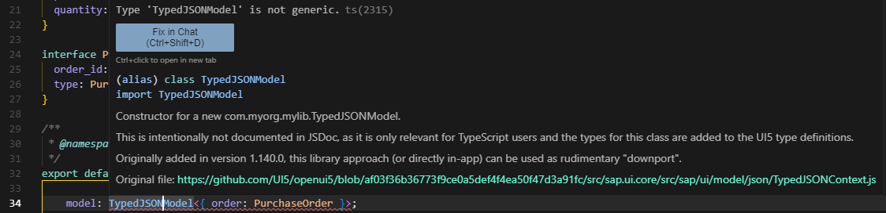

## PoC Downport: `TypedJSONModel`

The `TypedJSONModel` was first demoed during UI5ers live (Aug '25), and - unsurprisingly - everyone wanted to use it right away. The catch: it's only available in UI5 `>=1.140.0`.

Andreas Kunz and Peter Muessig proposed/mentioned a few things (paraphrased from our chat):

- The TypeScript definition that introduces `TypedJSONModel` is [here](https://github.com/UI5/typescript/blob/main/packages/dts-generator/src/resources/typed-json-model.d.ts). If you just drop this into your project, you’ll see the type, but your app will crash at runtime when you try to instantiate it. Unless you also provide the actual implementation files (remember: this is for older UI5 versions, where none of this exists).
- To make it work, you need to include the runtime classes that "bridge" the TypeScript definition with the UI5 runtime implementation (or the other way around):
    - [`TypedJSONModel` (extends JSONModel)](https://github.com/UI5/openui5/blob/af03f36b36773f9ce0a5def4f4ea50f47d3a91fc/src/sap.ui.core/src/sap/ui/model/json/TypedJSONModel.js)
    - [`TypedJSONContext` (extends Context)](https://github.com/UI5/openui5/blob/af03f36b36773f9ce0a5def4f4ea50f47d3a91fc/src/sap.ui.core/src/sap/ui/model/json/TypedJSONContext.js)

Peter’s tip (standalone, non-lib use case): If you inline the module definitions for both `TypedJSONModel` and `TypedJSONContext` in your app, you can get things working at runtime. Add the `.d.ts` file on top, and you’re set for both development and runtime. These two classes are tiny, so there’s no real performance impact.

## Notes

- Test the typing hints in the `Main.controller.ts` of the application. I didn’t write any code there myself actually, just quickly borrowed it from the [official test package](https://github.com/UI5/typescript/blob/main/test-packages/typed-json-model/webapp/controller/App.controller.ts).
- For the initial setup, I used [easy-ui5](https://github.com/ui5-community/generator-easy-ui5) and left everything with the default names/namespaces.
- Obviously, this approach means you’re responsible for keeping the type definition(s) up to date until you’re on UI5 `>=1.140.0`.
- Implementing it as a library and distributing it via npm begs the question about versioning for example: providing a min UI5 version but still allowing it to be used for anything higher than that or make it version flexible up to a min version(?). If you have ideas for that, I'd be open to hear them.
- Pro tip: I should really create more libraries. Most of my time was lost because I missed [this video](https://www.youtube.com/watch?v=7aAehB4ejHQ&t=3509s) ...

### Things to consider for the build (& making the consumption work)

#### Working with default exports

... thus not benefitting from [declaration merging](https://www.typescriptlang.org/docs/handbook/declaration-merging.html) and dealing with possible type definition overshadowing depending on the order of their declarations.

- After building the library the sorting order of the generated `.d.ts` triple slash directives inside the resulting `dist/index.d.ts` file is arbitrary and cannot be consistently influenced by a simple file rename. The relevant implementation of the build step can be found [here](https://github.com/ui5-community/ui5-ecosystem-showcase/blob/cfaf0739608b699fe6e14079bbd313873b7acdd9/packages/ui5-tooling-transpile/lib/task.js#L202). You could:
    - Patch the build task (though ... not worth for this niche/dirty scenario).
        - *Hint:* Using the config of the task itself, I wasn't able to exclude the files to maybe prevent the generation of the `d.ts` files for the empty classes themselves. Thus hoping to solve the declaration overshadowing. I currently don't know if they're 100% required for the lib to function in the first place to be honest. At first glance I also didn't see such an option within a babel configuration (possibly making use of providing a custom babel config).
    - Try to inline everything into a single file (not feasible for `.d.ts` files).
    - Or write a "postbuild"-script to move the [triple-slash directive](https://www.typescriptlang.org/docs/handbook/triple-slash-directives.html) as needed, which is what I (w. help of AI) **had** done in this [commit](https://github.com/wridgeu/ui5-poc-typed-jsonmodel-downport/tree/7fff38e8405a37e7cd172441b70f75e52cd3f9b6).
    ```ts
    /// <reference path="./resources/com/myorg/mylib/TypedJSONModelTypes.d.ts"/> <<< needs come 1st, if it wouldn't, your IDE would throw errs
    /// <reference path="./resources/com/myorg/mylib/TypedJSONModel.d.ts"/>
    /// <reference path="./resources/com/myorg/mylib/TypedJSONContext.d.ts"/>
    ```

#### Working with named exports

... here instead of `export default class` we use `export class` inside the `TypedJSONModel` and `TypedJSONContext` class, allowing for [declaration merging](https://www.typescriptlang.org/docs/handbook/declaration-merging.html). This can also be observed in the IDE when trying to navigate to the source of the imported class.

As you can see without declaration merging, the order of the triple slash directive inside the `dist/index.d.ts` becomes relevant again. Which means that the proper typing is overshadowed and a "navigate to source" would lead us to the empty implementation class instead of the `d.ts` file.



> [!NOTE]  
> It should also be possible to split up the type of `TypedJSONModelTypes.d.ts` into their respective class/module definitions.

**This is just a quick test. Nothing here is best practice (or even good practice). I’ve removed some files (like test directories) to keep the PoC focused, at least in the lib folder.**
