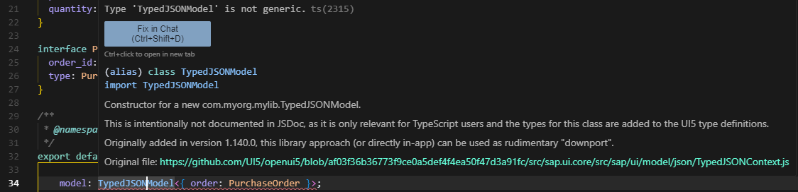

# UI5 Library com.myorg.mylib

Rudimentary dummy/poc with lots of copy paste, to test a manual downport ~

## Description

This app demonstrates a TypeScript setup for developing UI5 libraries. The central entry point for all information about using TypeScript with UI5 is at [https://sap.github.io/ui5-typescript](https://sap.github.io/ui5-typescript).

**The template is inspired by the [`SAP-samples/ui5-typescript-control-library`](https://github.com/SAP-samples/ui5-typescript-control-library) project. It explains how this setup is created and how all the bits and pieces fit together.**

## Requirements

Either [npm](https://www.npmjs.com/) or [yarn](https://yarnpkg.com/) for dependency management.

## Preparation

Use `npm` (or `yarn`) to install the dependencies:

```sh
npm install
```

(To use yarn, just do `yarn` instead.)

## Run the Library

Execute the following command to run the library locally for development in watch mode (the browser reloads the app automatically when there are changes in the source code):

```sh
npm start
```

As shown in the terminal after executing this command, the app is then running on http://localhost:8080/. A browser window with the URL pointing to your controls' test page should automatically open.

(When using yarn, do `yarn start` instead.)

## Debug the Library

In the browser, you can directly debug the original TypeScript code, which is supplied via sourcemaps (need to be enabled in the browser's developer console if it does not work straight away). If the browser doesn't automatically jump to the TypeScript code when setting breakpoints, use e.g. `Ctrl`/`Cmd` + `P` in Chrome to open the `*.ts` file you want to debug.

## Build the Library

### Unoptimized (but quick)

Execute the following command to build the project and get an app that can be deployed:

```sh
npm run build
```

The result is placed into the `dist` folder. To start the generated package, just run

```sh
npm run start:dist
```

Note that HTML page still loads the UI5 framework from the relative URL `resources/...`, which does not physically exist, but is only provided dynamically by the UI5 tooling. So for an actual deployment you should change this URL to either [the CDN](https://sdk.openui5.org/#/topic/2d3eb2f322ea4a82983c1c62a33ec4ae) or your local deployment of UI5.

(When using yarn, do `yarn build` and `yarn start:dist` instead.)

## Check the Code

Do the following to run a TypeScript check:

```sh
npm run ts-typecheck
```

This checks the libraries code for any type errors (but will also complain in case of fundamental syntax issues which break the parsing).

To lint the TypeScript code, do:

```sh
npm run lint
```

(Again, when using yarn, do `yarn ts-typecheck` and `yarn lint` instead.)

## License

This project is licensed under the Apache Software License, version 2.0 except as noted otherwise in the [LICENSE](LICENSE) file.

## Learning on TS during implementation

=> https://www.typescriptlang.org/docs/handbook/declaration-merging.html#disallowed-merges -- You cannot declaration merge a class with another class. So a `.d.ts` file that declares the class (no matter if named or default export) will not get merged. You will have a wrong behavior no matter how you mix it. It might happen that your design-time code completion works due to a somehow correct import but it won't work at runtime due to the mismatch of import vs export behavior (i.e. `.d.ts` declares default export so you import it like that but the actual implementation does a named export leading to a runtime error).

Here you can see what happens if the import is correct (runtime definition file/module) but the type isn't pulled (due to being overshadowed in the triple slash directive).


> [!NOTE]  
> It is also be possible to split up the type of `TypedJSONModelTypes.d.ts` into their respective class/module definitions entirely, getting rid of the additional `d.ts` file in the first place.
> ~~This can be seen [here](https://github.com/wridgeu/ui5-poc-typed-jsonmodel-downport/tree/merge-augmentation-and-class/com.myorg.mylib/src). Not manually splitting it up however, allows for easier maintenance (copying the original file from the UI5 frmwk source).~~ This was done under the false assumption of declaration merging and is wrong. Here I mix default and named exports leading to a correct development experience (depending on the import) but wrong runtime behavior.
